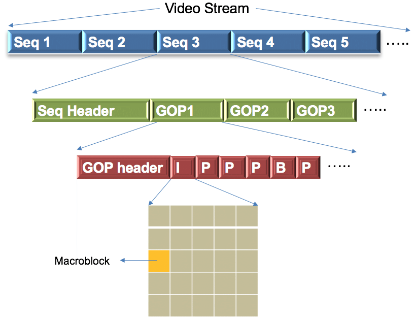

# Hands-On-FFMPEG

This project demonstrates some basic usages of FFMPEG, such as how to find keyframes of a video and how to extract pictures from a video.

## 1. Introduction

### What is FFMPEG?

FFMPEG is a vast software suite of libraries and programs for handling video, audio, and other multimedia files and streams. It can be used for 
format transcoding, basic editing (trimming and concatenation), video scaling, video post-production effects and etc. The name of the project is 
inspired by the MPEG (Moving Picture Experts Group) video standards group, together with "FF" for "fast forward".


The suite contains two usefull command line tools, ffmpeg and ffprobe. A typical use of the former is to convert video or audio formats and the latter
is usually utilized to display information of multimedia files.

### Basics of Multimedia files

A multimedia file usually contains several streams, such as one video stream, one audio stream and one subtitle stream. And a stream consists 
a myriad of frames (data). Taking video stream for example, it usually plays at a given frequency (let's say 20 frames per second) and by doing this 
it gives you an illusion of movement. All these data streams coexist in a container or wrapper format, which describes how different elements of 
data and metadata coexist in a computer file.

Data in multimedia is highly compressed. For instance, a 30-minute video with resolution of 1080*1920 would require a disk storage of 250G, but 
with the state of art compressing technology it only takes several Gigabytes on our PC. This introduces one critical, probably the most important, 
concept of multimedia: CODEC, which defines how the actual data is COded and DECoded - hence the name CODEC.


Data structure of a video stream is quite subtle. Generally speaking, it is made up of a series of sequences and every sequence consists of several
groups of pictures (GOP). A GOP is a group of video frames.



## 2. Command Lines of ffprobe

### Probe the information of a video

Type the following command line in your terminal:
```
ffprobe test.mp4
```
where test.mp4 is the video you want to probe. Two parts of information will be displayed. The first part gives information of FFMPEG, such as version info
and available libraries, and it looks like this
```
ffprobe version 4.0.2 Copyright (c) 2007-2018 the FFmpeg developers
  built with Apple LLVM version 9.1.0 (clang-902.0.39.2)
  configuration: --prefix=/usr/local/Cellar/ffmpeg/4.0.2 --enable-shared --enable-pthreads --enable-version3 --enable-hardcoded-tables --enable-avresample --cc=clang --host-cflags= --host-ldflags= --enable-gpl --enable-libmp3lame --enable-libx264 --enable-libxvid --enable-opencl --enable-videotoolbox --disable-lzma
  libavutil      56. 14.100 / 56. 14.100
  libavcodec     58. 18.100 / 58. 18.100
  libavformat    58. 12.100 / 58. 12.100
  libavdevice    58.  3.100 / 58.  3.100
  libavfilter     7. 16.100 /  7. 16.100
  libavresample   4.  0.  0 /  4.  0.  0
  libswscale      5.  1.100 /  5.  1.100
  libswresample   3.  1.100 /  3.  1.100
  libpostproc    55.  1.100 / 55.  1.100
```
It can be closed by adding parameters to you command line:
```
ffprobe -hide_banner test.mp4
```

The second part displays basic information of the video, such as its duration, fps (frames per second).
```
Input #0, mov,mp4,m4a,3gp,3g2,mj2, from 'test.mp4':
  Metadata:
    major_brand     : isom
    minor_version   : 512
    compatible_brands: isomiso2avc1mp41
    encoder         : Lavf57.25.100
    comment         : GIFSHOW [475511355][LeMobile|Le X620][6.0|23][le_x6][5.6.2.5992][Camera:f][RealFps:16.4][Encode:mediamuxer][Recorder:hardware_recorder][EditorVer:fullScreen3][BeautyType:ks][慕斯:0.65][BeatEnable:false]
  Duration: 00:00:16.21, start: 0.000000, bitrate: 5198 kb/s
    Stream #0:0(und): Video: h264 (High) (avc1 / 0x31637661), yuv420p(tv, smpte170m/unknown/unknown), 720x1280, 5195 kb/s, 20 fps, 20 tbr, 200k tbn, 40 tbc (default)
    Metadata:
      handler_name    : VideoHandler
    Stream #0:1(und): Audio: aac (HE-AAC) (mp4a / 0x6134706D), 44100 Hz, stereo, fltp, 48 kb/s (default)
    Metadata:
      handler_name    : SoundHandler
```
One can find that `test.mp4` has a duration of `00:00:16.21`, one video stream with `fps = 20` and one audio stream.

### Probe the information of every frame

`ffprobe` is able to give you a glance of every frame compressed in a video. A basic usage is shown by the following command line:
```
ffprobe -loglevel error -select_streams v:0 -show_frames test.mp4
```
In the command line we have set the loglevel to be `error` and choose to probe the first video stream (`-select_stream v:0`). The message 
displayed on your screen may have a structure looks like this
```
[FRAME]
.
.
.
[/FRAME]
[FRAME]
media_type=video
stream_index=0
key_frame=0
pkt_pts=3180000
pkt_pts_time=15.900000
pkt_dts=3180000
pkt_dts_time=15.900000
best_effort_timestamp=3180000
best_effort_timestamp_time=15.900000
pkt_duration=10000
pkt_duration_time=0.050000
pkt_pos=10346277
pkt_size=54331
width=720
height=1280
pix_fmt=yuv420p
sample_aspect_ratio=N/A
pict_type=P
coded_picture_number=315
display_picture_number=0
interlaced_frame=0
top_field_first=0
repeat_pict=0
color_range=tv
color_space=smpte170m
color_primaries=unknown
color_transfer=unknown
chroma_location=left
[/FRAME]
[FRAME]
.
.
.
[/FRAME]
```
Let's have a careful look at every entry of the frame info. The first one, `media_type=video`, tells us this frame belongs to a video 
stream while the second entry, `stream_index=0`, informs us this video stream is the first stream in the multimedia file. `key_frame=0`
and `pict_type=P` illustrate this frame is not a key frame and it is a P frame. Three kinds of picture types may be found in a video stream,
which are I frame, P frame and B frame. An I frame  is coded independently of all other pictures while B frame and P frame contain 
motion-compensated difference information relative to previously decoded pictures and to both previously and forwardly frames respectively.
However, an I frame is not necessarily a key frame. Different people define key frame differently.

`pkt_pts_time` and `pkt_dts_time` pinpoint when the frame will be displayed and decoded while `pkt_duration_time` shows how long it will
be played. All these three times are calculated from the internal time base of the multimedia file and that's why there are three other
time stamps presented in the info table.

### Export info into .txt files

It seems silly and useless to dump all the frame information on the screen. Alternatively, one can dump all the info into a txt file:
```
ffprobe -loglevel error -select_streams v:0 -show_frames test.mp4 > frames.txt
```
Of course, feel free to change the name of the exported txt file.

### Probe info of the key frames in a video stream

Key frames are the anchors in a video stream and they are important if you want to know how a video stream is compressed. 
The following command can be used to display key frames selectively:
```
ffprobe -loglevel error -select_streams v:0 -show_frames -skip_frame nokey test.mp4
```

### Dump frame information in CSV format

FFMPEG provides several output formats and CSV is one of them. A basic usage looks like this
```
ffprobe -loglevel error -select_streams v:0 -show_frames -skip_frame nokey -of csv test.mp4
```
and the output has the following structure:
```
frame,video,0,1,0,0.000000,2300000,11.500000,0,0.000000,10000,0.050000,9682,77670,720,1280,yuv420p,N/A,I,0,0,0,0,0,tv,smpte170m,unknown,unknown,left
frame,video,0,1,990000,4.950000,N/A,N/A,990000,4.950000,10000,0.050000,3510776,81944,720,1280,yuv420p,N/A,I,1,0,0,0,0,tv,smpte170m,unknown,unknown,left
frame,video,0,1,2320000,11.600000,N/A,N/A,2320000,11.600000,10000,0.050000,7722122,81796,720,1280,yuv420p,N/A,I,2,0,0,0,0,tv,smpte170m,unknown,unknown,left
```

The keys can be turned on or off by a parameter named `nk` (no key)
```
ffprobe -loglevel error -select_streams v:0 -show_frames -skip_frame nokey -of csv=nk=0 test.mp4
```

### Display entries selectively

Sometimes you may want to know only one entry of the frame information rather than all of them. For instance, the following 
command displays presentation time exclusively,
```
ffprobe -loglevel error -select_streams v:0 -show_frames -skip_frame nokey -show_entries frame=pkt_pts_time test.mp4
```
And another command line displays decoding time as well as presentation time,
```
ffprobe -loglevel error -select_streams v:0 -show_frames -skip_frame nokey -show_entries frame=pkt_pts_time,pkt_dts_time test.mp4
```

The output may take the following form:
```
[FRAME]
pkt_pts_time=0.000000
[/FRAME]
[FRAME]
pkt_pts_time=4.950000
[/FRAME]
[FRAME]
pkt_pts_time=11.600000
[/FRAME]
```
I personally find the section name, `[FRAME] ... [/FRAME]`, annoying. If you feel the same way, try to turn it off using the following command
```
ffprobe -loglevel error -select_streams v:0 -show_frames -skip_frame nokey -show_entries frame=pkt_pts_time -of csv=print_section=0 test.mp4
```

### Count the location of I frames

Using the following trick, one is able to locate all the I frames in a video stream
```
ffprobe -show_frames -select_streams v:0 -show_entries frame=pict_type -of csv test.mp4 | grep -n I | cut -d ':' -f 1
```

## 3. Interaction with Python

The following codes illustrate how to interact with FFMPEG in Python
```
import subprocess

video_path = '/file_path_on_ur_pc/test.mp4'

command1 = ['ffprobe', '-show_frames', '-select_streams', 'v:0', '-show_entries', 'frame=pict_type',
            '-of', 'csv', video_path]
p1 = subprocess.Popen(command1, stdout=subprocess.PIPE, stderr=subprocess.PIPE)
command2 = ['grep', '-n', 'I']
p2 = subprocess.Popen(command2, stdin=p1.stdout, stdout=subprocess.PIPE, stderr=subprocess.PIPE)
command3 = ['cut', '-d', ':', '-f',  '1']
p3 = subprocess.Popen(command3, stdin=p2.stdout, stdout=subprocess.PIPE, stderr=subprocess.PIPE)
out, err = p3.communicate()
key_frame_index = [int(i) for i in out.decode().split('\n') if i != '']
```

## 4. Comand lines of `ffmpeg`

### Format Conversion

#### CPU version

Sometimes you may have a movie on your computer which you want to watch very much but your video player does not support the
video format (or container in our terminology). In this case, you can use FFMPEG to transcode the original video into a disired
one. For instance, you have a `movie.avi` and want to transcode it into `movie.mp4`. The following command will do the trick
```
ffmpeg -loglevel error -i movie.avi movie.mp4
```

#### GPU version

Video format conversion using CPU can be a bit slow because it comsumes computer resources excessively. A 90 minutes movie may 
take several minutes to transcode. And once it is done, your computer may be huffing and puffing. If you have GPU at hand by any
chance, you can accelerate the process with it. And here is an example
```
ffmpeg -y -hwaccel cuvid -vsync 0 -i movie.avi -vcodec h264_nvenc -gpu 0 movie.mp4
```
In the command line, `-y` means replacing the output file if it exists, `-hwaccel cuvid` instructs `ffmpeg` to decode the input file
using `CUDA` and `-vcodec h264_nvenc` defines the video CODEC for the output file. Optionally, one can choose the GPU number manually,
`-gpu 0`, but remember not to put this option infront of input file.

#### Cheat version

GPU will not accellerate the whole process dramatically but another method will. Suppose we still want to transcode the `movie.avi` into
`movie.mp4`. The following command will achieve it within a few seconds
```
ffmpeg -y -i movie.avi -codec copy movie.mp4
```
Is not this amazing? Personally, I was astonished by the speed. This is possible because containers `mp4` and `avi` share the same
video and audio CODECs. When we do the format conversion, `ffmpeg` will copy all the data from the original file into the output media 
and this process is ultra-fast. The following containers (video formats) all share the same CODECs with `mp4`
```
avi, mov, mkv, flv, f4v, webm
```
But not all containers share the same CODECs. For example, `wmv` and `rmvb` do not share the same CODECs with `mp4`.

### Extract a slice of video

Suppose you have a video and want to cut a piece of it. Let's say the duration of the video is 15 seconds and the slice starts from 5 
seconds to 10 seconds. There are several equivalent ways to achieve this:
```
1. ffmpeg -i video.mp4 -ss 5 -t 5 slice.mp4
2. ffmpeg -i video.mp4 -ss 5 -to 10 slice.mp4
3. ffmpeg -i video.mp4 -ss 00:00:05 -t 00:00:05 slice.mp4
4. ffmpeg -i video.mp4 -ss 00:00:05 -to 00:00:10 slice.mp4
5. ffmpeg -ss 5 -t 5 -i video.mp4 slice.mp4
6. ffmpeg -ss 5 -i video.mp4 -t 5 slice.mp4
.
.
.
```
Here `-ss` means where the seek starts, `-to` where it ends and `-t` how long the seek endures. The timestamp can be assigned 
using either clocktime (`00:00:05`) or seconds (`5.5`); the liberty is left to you. Seeking options, `-ss` and `-to`/`-t`, can be put 
either in front of the input file or behind it; it causes no difference when you cut a slice from a video using coding and decoding method.
Howerver, if you are trying to copy streams from the original video to the slice, the position of seeking options can become very tricky.

Of course, you can accelerate the whole process with GPU and more threads
```
ffmpeg -y -threads 16 -hwaccel cuvid -vsync 0 -ss 5 -to 10 -i video.mp4 -vcodec h264_nvenc -gpu 3 slice.mp4
```

### Extract pictures 

Pictures of a video can be extracted using a simple command and the speed is fast
```
ffmpeg -i test.mp4 test_%03d.jpg
```
Probably you will get a full screen of this:


You can re-scale the output pictures as you like:
```
ffmpeg -i test.mp4 -vf scale=iw*0.5:ih*0.5 scaled_%3d.jpg
```

Suppose there is a picture in the 10th second which interests you very much, but you have no idea which one it exactly is. You can extract 
all the pictures in the 10th second and examine them for yourself:
```
ffmpeg -i test.mp4 -ss 10 -vframes 20 pic_%02d.jpg
```

A useful trick is to extract all the I frames from a video
```
ffmpeg -i test.mp4 -vf select='eq(pict_type\,I)' iframe-%02d.jpg
```

## 5. FFMPEG libraries

FFMPEG provides not only powerful command lines but also useful libraries, which are callable in your codes. The following is an example that
saves the keyframes of a video. The example calls the libraries of the latest version (`4.0.2`) and it is written in `C`.
```
#include <libavcodec/avcodec.h>
#include <libavformat/avformat.h>
#include <libswscale/swscale.h>
#include <libavutil/imgutils.h>
#include <stdio.h>


void SaveFrame(AVFrame *pFrame, int width, int height, int iFrame) {
    printf("Saving keyframe: %d\n", iFrame);
    FILE *pFile;
    char szFilename[32];
    int  y;

    // Open file
    sprintf(szFilename, "frame%d.ppm", iFrame);
    pFile=fopen(szFilename, "wb");
    if(pFile==NULL)
        return;

    // Write header
    fprintf(pFile, "P6\n%d %d\n255\n", width, height);

    // Write pixel data
    for(y=0; y<height; y++)
        fwrite(pFrame->data[0]+y*pFrame->linesize[0], 1, width*3, pFile);

    // Close file
    fclose(pFile);
}

int main(int argc, char *argv[]) {
    // Initalizing these to NULL prevents segfaults!
    AVFormatContext   *pFormatCtx = NULL;
    int               i, videoStream;
    AVCodecParameters *pCodecCtxOrig = NULL;
    AVCodecContext    *pCodecCtx = NULL;
    AVCodec           *pCodec = NULL;
    AVFrame           *pFrame = NULL;
    AVFrame           *pFrameRGB = NULL;
    AVPacket          packet;
    int               numBytes;
    uint8_t           *buffer = NULL;
    struct SwsContext *sws_ctx = NULL;

    if(argc < 2) {
        printf("Please provide a movie file\n");
        return -1;
    }
    // Register all formats and codecs
    avformat_network_init();

    // Open video file
    if(avformat_open_input(&pFormatCtx, argv[1], NULL, NULL)!=0)
        return -1; // Couldn't open file

    // Retrieve stream information
    if(avformat_find_stream_info(pFormatCtx, NULL)<0)
        return -1; // Couldn't find stream information

    // Dump information about file onto standard error
    av_dump_format(pFormatCtx, 0, argv[1], 0);

    // Find the first video stream
    videoStream=-1;
    // printf("number of streams = %u\n", pFormatCtx->nb_streams);
    for(i=0; i<pFormatCtx->nb_streams; i++)
        if(pFormatCtx->streams[i]->codecpar->codec_type==AVMEDIA_TYPE_VIDEO) {
            videoStream=i;
            break;
        }
    if(videoStream==-1)
        return -1; // Didn't find a video stream

    // Get a pointer to the codec context for the video stream
    pCodecCtxOrig=pFormatCtx->streams[videoStream]->codecpar;
    // Find the decoder for the video stream
    pCodec=avcodec_find_decoder(pCodecCtxOrig->codec_id);
    if(pCodec==NULL) {
        fprintf(stderr, "Unsupported codec!\n");
        return -1; // Codec not found
    }
    // Copy context
    pCodecCtx = avcodec_alloc_context3(pCodec);
    if(avcodec_parameters_to_context(pCodecCtx, pCodecCtxOrig) != 0) {
        fprintf(stderr, "Couldn't copy codec context");
        return -1; // Error copying codec context
    }

    // Open codec
    if(avcodec_open2(pCodecCtx, pCodec, NULL)<0)
        return -1; // Could not open codec

    // Allocate video frame
    pFrame=av_frame_alloc();

    // Allocate an AVFrame structure
    pFrameRGB=av_frame_alloc();
    if(pFrameRGB==NULL)
        return -1;

    // Determine required buffer size and allocate buffer
    numBytes=av_image_get_buffer_size(AV_PIX_FMT_RGB24, pCodecCtx->width,
            pCodecCtx->height, 1);
    printf("Number of Bytes = %d\n", numBytes);
    buffer=(uint8_t *)av_malloc(numBytes*sizeof(uint8_t));

    // Assign appropriate parts of buffer to image planes in pFrameRGB
    // Note that pFrameRGB is an AVFrame, but AVFrame is a superset
    // of AVPicture
    av_image_fill_arrays(pFrameRGB->data, pFrameRGB->linesize, buffer, AV_PIX_FMT_RGB24,
            pCodecCtx->width, pCodecCtx->height, 1);

    // initialize SWS context for software scaling
    sws_ctx=sws_getContext(pCodecCtx->width,
            pCodecCtx->height,
            pCodecCtx->pix_fmt,
            pCodecCtx->width,
            pCodecCtx->height,
            AV_PIX_FMT_RGB24,
            SWS_BILINEAR,
            NULL,
            NULL,
            NULL
            );
    if(sws_ctx == NULL)
        printf("Cannot initialize the conversion context\n");

    // Read frames and save ke y frames to disk
    int i=0
    while(av_read_frame(pFormatCtx, &packet)>=0) {
        // Is this a packet from the video stream?
        if(packet.stream_index==videoStream) {
            // Decode video frame
            if(avcodec_send_packet(pCodecCtx, &packet) != 0)
                continue;

            while(avcodec_receive_frame(pCodecCtx, pFrame) == 0)
            {
                // printf("Frame PTS = %lld\", pFrame->pts);
                if(pFrame->key_frame == 1)
                {
                    sws_scale(sws_ctx, (uint8_t const * const *)pFrame->data,
                            pFrame->linesize, 0, pCodecCtx->height,
                            pFrameRGB->data, pFrameRGB->linesize);
                    SaveFrame(pFrameRGB, pCodecCtx->width, pCodecCtx->height, ++i);
                }
            }
        }

        // Free the packet that was allocated by av_read_frame
        av_packet_unref(&packet);
    }

    // Free the RGB image
    av_free(buffer);
    av_frame_free(&pFrameRGB);

    // Free the YUV frame
    av_frame_free(&pFrame);

    // Close the codecs
    avcodec_close(pCodecCtx);
    avcodec_parameters_free(&pCodecCtxOrig);

    return 0;
}
```

You can use the following command line to compile the code:
```
gcc -o savekf savekf.c -lavutil -lavformat -lavcodec -lswscale -lz -lavutil -lm
```
and try it on `test.mp4`
```
./savekf test.mp4
```
